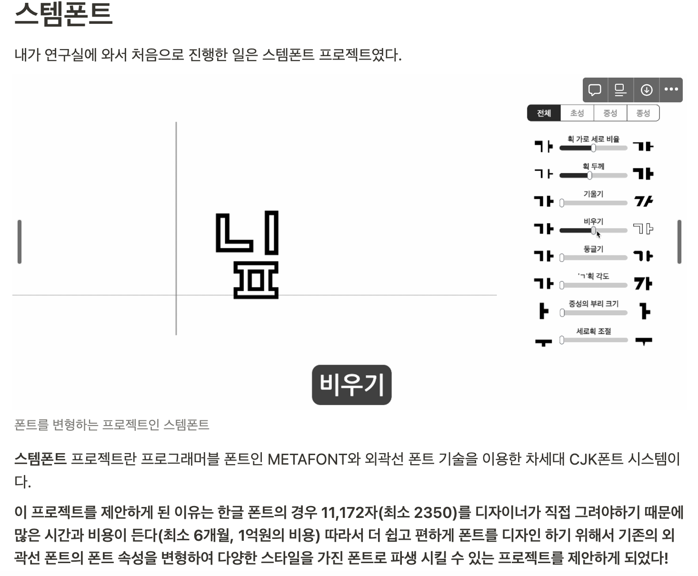
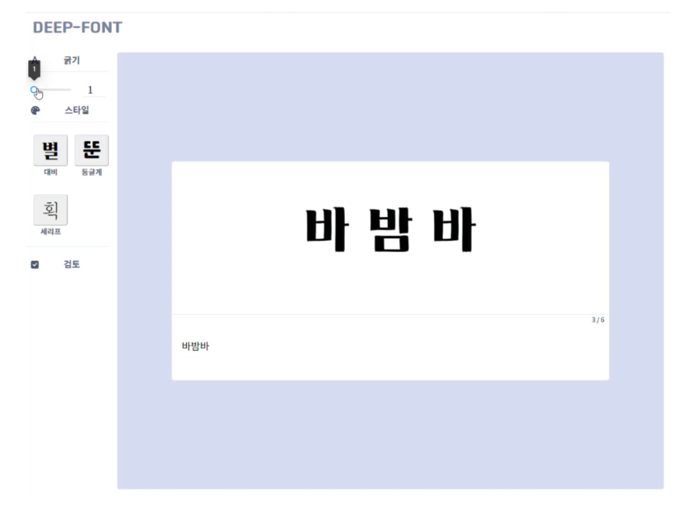
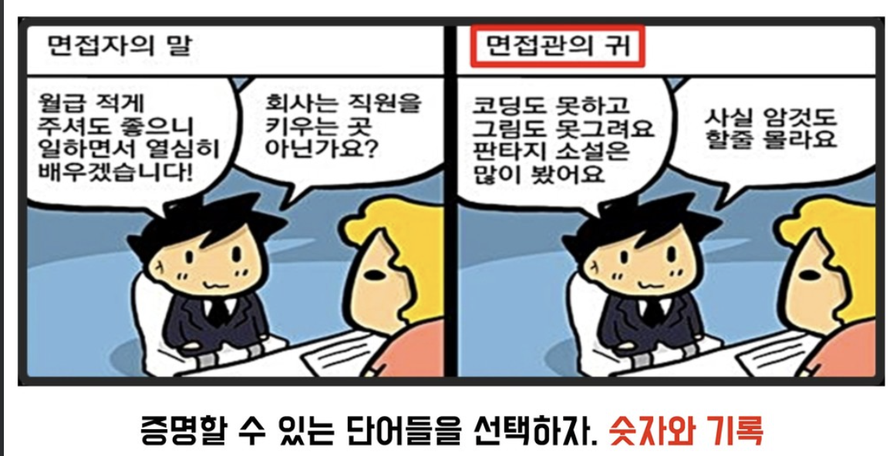

### 1년차 회고

연구실을 졸업하고 취업한지 1년이 되었다.

작년 이 맘때 쯤에도 연구실 졸업하고 그 동안 했던 일을 정리하기 위해 회고록을 썼었다.



연구실에서 진행 했던 프로젝트 중 하나인 스템폰트

연구실에서 폰트 도메인에서 프로젝트를 했고 그 당시에 굉장히 핫 했던 AI를 졸업 논문으로 삼았으나…

AI쪽은 일을 하다보니 내 적성과 맞지 않다고 생각이들었고(있는 모델 조금 수정해서 결과 내기…학습  결과 기다리기 등) 그 당시에도 MLops, 프론트, 백엔드 개발에 더 관심이 있어서 졸업 과제를 스템폰트처럼 웹으로 서비스 할 수 있도록 만들거나 블로그를 만들었다~~.(아니 블로그 어떻게 만든거지?)~~



그때 교수님이 왜 이런거 만드냐 했는데ㅎㅎㅎㅎ…결국 자기 일에 써먹었죠?

그 당시에 MLops를 할 수 있는 회사를 몇군데 찾아서 하나하나씩 쓰고있었는데 1지망,3지망은 안 되고 지인이 있던 2지망이 되었다. 시스템 프로그래밍을 하는 회사로 초봉을 굉장히 높게 부르길래 뒤도 돌아보지 않고 가게 되었다 ~~(뒤는 좀 돌아보지 그랬냐 현수야)~~

적성에 대한 고민은 많이 했지만 그 당시 여러 집안 사정으로 인하여 돈을 빨리 벌어 독립을 하고 싶었고 지금 회사에 가게 되면 그 꿈을 이룰 수 있었다 물론 그 당시에도 시스템 프로그래밍이라는 분야에 진입한다는 것에 많은 고민이 있었다.

하지만 연구실 선배들도 자기가 여기서 했던 경험이나 도메인을 잘 사용할 수 있을거라 생각했지만 아니였다는 얘기를 듣고 용기를 갖고 회사에 입사하게 되었다.

그렇게 1년의 시간이 지났고

나는 이력서를 다시 쓰게 되었다.

### 이력서를 다시 쓰게 된 이유

1년 동안 일을 하게 되면서 나를 좀 더 알 수 있었다.

나는 돈 보다는 환경, 분위기에 좀 더 예민한 사람이였다는 것이다. 

(좀더 수평적 문화인 스타트업에 잘 어울리는거 같다) 

그리고 시스템 프로그래밍은 익숙하지 않아서 인지 일이 참 재미가 없다고 느꼈다…

일에 재미를 느끼려면 80을 알고 20을 채워나가면서 성취감을 얻는 것인데 20(20이나 아나?) 80을 모르는 상태다보니 일에 대한 자신이 떨어진 느낌이였다.(사수한테 뭔가 물어보면 이것도 모르고 저것도 몰라서 원숭이가 된 느낌~~우끼끼~~) 

그래서 일에 대한 재미가 떨어지고 책임감으로만 회사를 다니게 되니 능률이 더 떨어지는걸 느껴 대학 동기들과 여러 인생 스승님(?)들에게 상담을 통해 이직을 하는게 좋아보인다고 얘기 해줬고 그렇게 이직을 준비하게 되었다.

회사에 처음 들어갔을 때도 그동안 휴학도 없이 계속 다녔으니 1년만 쉬자 생각 했었는데 과거의 나는 미래 참 잘 안 거 같다.

### 이력서를 써보면서…

완전 이직 준비가 되지 않은 상태에서 무작정 지인이 다니고 있는 회사의 백엔드 신입으로 이력서를 쓰게 되었는데 진짜 1년 동안 놀기만 했다는 걸 느꼈다.

이직 관련 얘기를 정리된 글 중에서 충격을 받은 대목이 하나 있었다.

어떤 분이 면접을 보러 갔는데 지금 1년 동안 본 개발책이 있냐는 것이었다.

나 또한 이 질문에 ~~(긁)~~ 관통을 당해버렸는데 회사 일이 바쁘고 해당 분야에 대한 정보가 없다는 핑계로 관심있거나 이직하고 싶은 직종의 공부는 하나도 하지 않았던 것을 느꼈다.

또한 이력서를 정리하면서 내 경력사항을 보니 

```
외부활동 x 대학원에서 AI로 석사 → 시스템 소프트웨어 개발자 → 백엔드 신입으로 변경?
```

이렇게 경력이 이어지지않고 분절되다보니 이력서 피드백으로 면접자 입장에서 할 질문이 없다고 했다.

또한 현재 회사에서 했었던 일을 정리 해보니 내가 이걸 해서 수치적으로 이렇게나 좋아졌어요라고 이력서에 적어야 하는데 이런식으로 기록을 하지 않아서인지 이력서에 수치적으로 얼마나 개선 됐는지에 대한 방식으로 적기가 어려웠다.



흑흑… 나 진짜 암것도 할 줄 모르나봐…

일단 내부 추천으로 넣어보긴 했으나… 잘 안 될 거 같아 마음의 준비는 했다. ~~(아 떨어지면 하칸 트라이 가야지~~)

### 그래도 느낀점?

 이력서를 써서 내 민낯을 보니 오히려 어떤 점을 채울 수 있는지 알 수 있었다.

받은 피드백에서 지금 하는 일과 백엔드 분야는 엮을 수 있어서 개인 포폴을 준비하면 이직을 잘 준비할 수 있을거라는 얘기를 들어 개인 포폴을 준비하면서 이직을 준비해볼 예정이다.

그래서 일단 세운 계획은 다음과 같다

1. 백엔드 CRUD의 국밥인 게시판 만들기
2. 프론트는 재밌으니 이전에 만들었던 gatsby 블로그에 글 정리해서 올리기
3. github도 꾸준히 관리하기

백엔드를 하지만 프론트를 다룰 수 있는건 매우 이점이 있다 생각하여 ~~(나 사실 프론트 좋아하나…?)~~ 계속 공부를 할 예정이다.

회사일에 벗어나서 개발 공부를 하니 환기되는 기분도 들고 매우 좋았다.

매일매일은 아니라도 꾸준히 공부 정리를 해서 발전해나갈 예정이다.

이 글을 1년 지난 후 봤을 때 좋은 기분이 들었으면 좋겠다