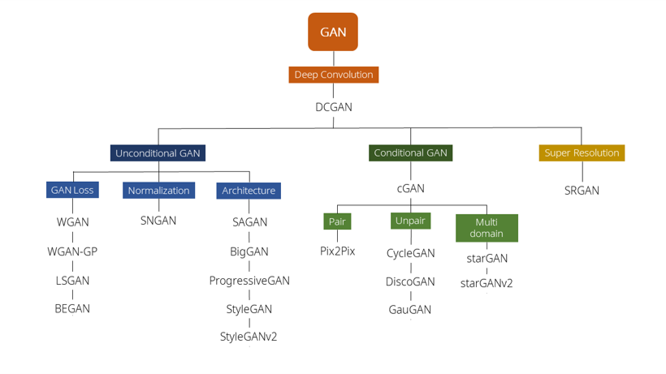
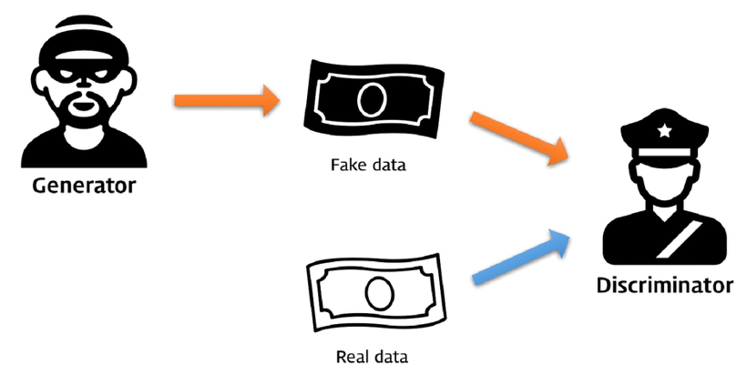
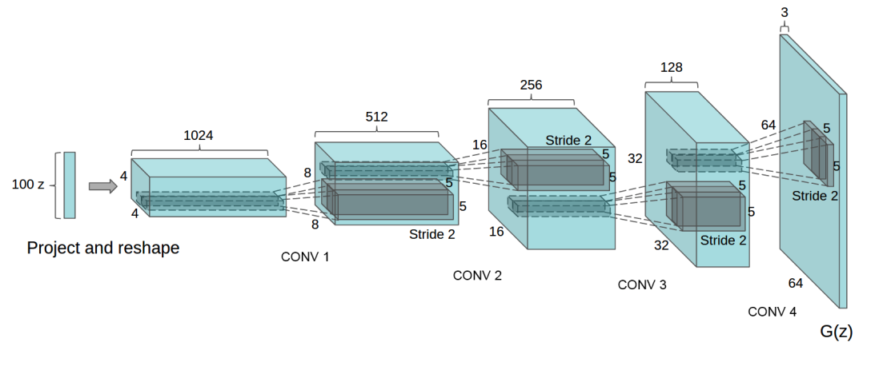
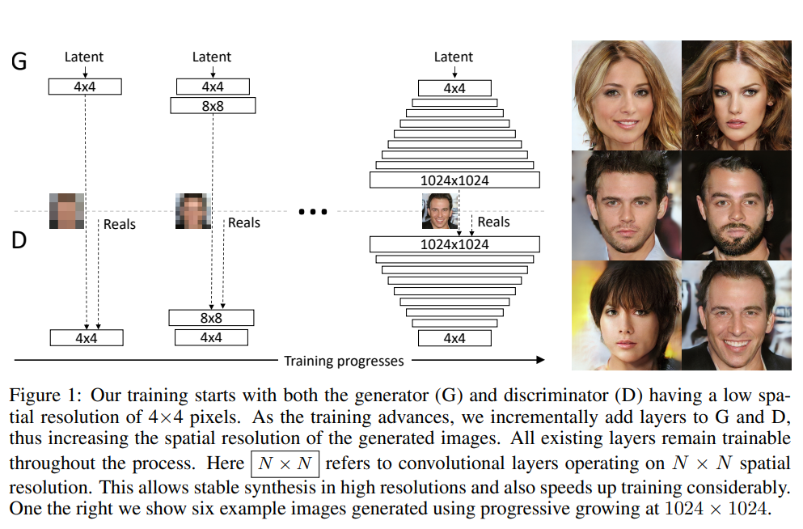
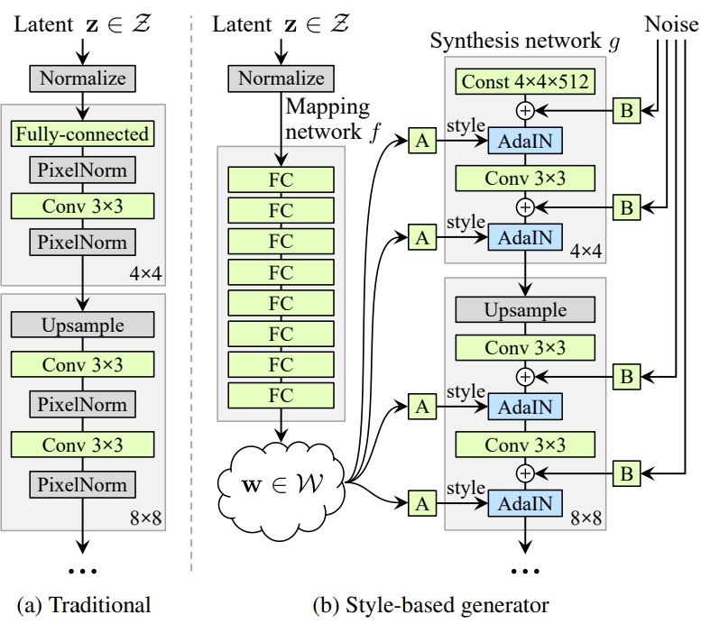

## 논문 소개

---

- **저자**: Tero Karras, Samuli Laine, Timo Aila
- **paper**: https://arxiv.org/abs/1812.04948
- **CVPR 2019**
- **목표**:
  1. 고화질 이미지를 생성하며
  2. 특징이 분리된 잠재공간(Disentanglement latent space) 구성을
  3. 복잡한 손실 함수 없이 모델의 구조를 제안 했다.

## 사전지식

### GAN

GAN 모델은 [2014년 Ian Goodfellow가 제안한 생성 모델](!https://arxiv.org/abs/1406.2661)로 후에 나온 생성 모델들은 모두 GAN 구조를 기반으로 했다고 해도 과언이 아니다.



<figcaption>GAN의 가계(?)도</figcaption>
GAN의 구조에 대해 간략하게 설명해보자면 GAN은 이미지 생성을 담당하는 생성자(Generator) 생성된 가짜 이미지와 진짜 이미지를 판별하는 판별자(Discriminator)로 구성 되어있다. GAN을 공부한 사람들이 많이 본 비유는 아마 위조지폐범과 그를 잡는 경찰일 것이다.



즉 **생성자는 진짜와 비슷한 위조 지폐(가짜 이미지/생성된 이미지)를 만드는 것이고** **판별자는 생성자가 만든 위조 지폐와 진짜 지폐를 두고 위조지폐를 찾는 경찰** 인 것이다!

학습을 진행하면서 생성자와 판별자는 경쟁적으로 학습을 하게 되고 결국 생성자는 **판별자가 구분할 수 없을 정도로 그럴듯한(진짜같은) 이미지를 만들게 된다**

그러나 초기의 GAN(VanillaGAN)은 단순히 선형 레이어 여러개로만 이뤄져서 안정적으로 학습할 할 수 없다는 단점이 있었다. 이를 개선한 것이 2015에 나온[DCGAN](https://arxiv.org/abs/1511.06434) 논문이다. 이 모델은 기존의 GAN 모델에 CNN 구조를 더해 학습이 안정적으로 될 수 있는 구조를 제안하였다(후속 모델들은 사실 DCGAN의 구조를 기반으로 나왔다.)



더 자세한 설명은 [쉽게 쓰여진 GAN](https://dreamgonfly.github.io/blog/gan-explained/) 글을 보면 좋다. 이해하기 쉬운 설명과 코드까지 있는 좋은 글이다.

오늘 GAN의 전반적인 내용을 다루는 것이 아니기 때문에 StyleGAN 이전에 나온 ProGAN에 대해서 먼저 설명해고자 한다.

### ProGAN

[2017년에 나온 ProGAN](https://arxiv.org/abs/1710.10196)은 **생성자와 판별자를 점진적으로 키우면서 고화질의 이미지를 생성하는 모델 구조**를 제안하였다.



즉 생성자가 4x4 ... 8x8 ... 16x16 ... 512x512 크기의 이미지를 생성하는 레이어가 학습과정에 추가가 되면 판별자도 이와 대응 되게 레이어가 추가 된다.

이걸 코드로 보면 [코드출처](https://github.com/rosinality/progressive-gan-pytorch/blob/master/model.py)

```python
class Generator(nn.Module):
    def __init__(self, code_dim=512 - 10, n_label=10):
        super().__init__()

        self.label_embed = nn.Embedding(n_label, n_label)
        self.code_norm = PixelNorm()
        self.label_embed.weight.data.normal_()

        self.progression = nn.ModuleList([ConvBlock(512, 512, 4, 3, 3, 1), #4x4
                                          ConvBlock(512, 512, 3, 1), #8x8
                                          ConvBlock(512, 512, 3, 1), #16x16
                                          ConvBlock(512, 512, 3, 1), #32x32
                                          ConvBlock(512, 256, 3, 1), #64x64
                                          ConvBlock(256, 128, 3, 1)]) #128x128
```

생성자와 대응되게 판별자도

```python
class Discriminator(nn.Module):
    def __init__(self, n_label=10):
        super().__init__()

        self.progression = nn.ModuleList([ConvBlock(128, 256, 3, 1,
                                                    pixel_norm=False,
                                                    spectral_norm=False), # 4x4
                                          ConvBlock(256, 512, 3, 1,
                                                    pixel_norm=False,
                                                    spectral_norm=False), # 8x8
                                          ConvBlock(512, 512, 3, 1,
                                                    pixel_norm=False,
                                                    spectral_norm=False), # 16x16
                                          ConvBlock(512, 512, 3, 1,
                                                    pixel_norm=False,
                                                    spectral_norm=False), # 32x32
                                          ConvBlock(512, 512, 3, 1,
                                                    pixel_norm=False,
                                                    spectral_norm=False), # 64x64
                                          ConvBlock(513, 512, 3, 1, 4, 0,
                                                    pixel_norm=False,
                                                    spectral_norm=False)]) # 128x128
```

점진적으로 레이어가 추가되는 것을 볼 수 있다.(레이어가 추가되는 기준은 α 값을 기준으로 두는 걸로 알고 있다)

우리의 목표는 StyleGAN이기 때문에 자세한 설명은 [ProGAN설명 블로그](https://towardsdatascience.com/progan-how-nvidia-generated-images-of-unprecedented-quality-51c98ec2cbd2)를 보면 좋을거 같다. (ProGAN도 설명 할 것이 너무 많다 minibatch나... 모델 구조에 대한 자세한 설명이나.. 글을 따로 써야할 둡)

이렇게 고화질의 사람 이미지를 생성하는데에는 좋은 성능을 보여주었으나 이미지 특징 제어가 어렵다는 단점이 있다.

그렇다면 ProGAN의 후속 모델은 StyleGAN은 어떻게 이 문제를 해결했는지 정말 본격적으로 알아보자.

## 본론

이 부분에서는 StyleGAN이 이전 ProGAN의 문제를 어떻게 해결 했는지 이를 통해서 어떤 결과를 얻었는지에 대해 설명한다.

### 모델의 구조

- **Mapping Network**

  ProGAN의 후속 모델인 StyleGAN은 ProGAN 모델 구조에 Mapping Network를 추가하였다.

  
  <figcaption align="center">StyleGAN의 구조</figcaption>
  기존의 모델들은 가우시안분포(정규분포, 평균이 0이고 분산이 1인 분포)에서 무작위 벡터를 뽑아 바로 모델에 넣었지만 StyleGAN에서는 가우시안 분포에서 추출한 $z$ 벡터를 8개의 Fully Connected layer(MLP)로 이루어진 Mapping Network에 통과 시켜 $w$ 벡터로 만든다.

  ```python
  class StyledGenerator(nn.Module):
    def __init__(self, code_dim=512, n_mlp=8):
        super().__init__()

        self.generator = Generator(code_dim)

        layers = [PixelNorm()]
        for i in range(n_mlp): # Mapping Network 정의
            layers.append(EqualLinear(code_dim, code_dim))
            layers.append(nn.LeakyReLU(0.2))

        self.style = nn.Sequential(*layers)
  ```

  ```python
  def forward(
        self,
        input,
        noise=None,
        step=0,
        alpha=-1,
        mean_style=None,
        style_weight=0,
        mixing_range=(-1, -1),
    ):
        styles = []
        if type(input) not in (list, tuple):
            input = [input]

        for i in input: # z벡터를 w벡터로 변환
            styles.append(self.style(i))
  ```

  왜 Mapping Network를 추가하였을까? 이는 모델의 **특징 분리된 잠재 공간**을 구성하기 위함이다 예를 들어서 특징이 분리되어있지 않은 잠재 공간인 경우 머리색을 바꿨더니 얼굴의 다른 부분이 바꾸게되는 것이다.

  특징이 분리된 잠재 공간에 대한 자세한 얘기는 다음 문단에서 하기로 하고 Mapping Network만큼 중요한 AdalN이라는 연산에 대해 설명해보자 한다.

- **AdalN**
  AdalN 기법은 [Adaptive Instance Normalization(AdalN)](https://arxiv.org/abs/1703.06868v2)에서 제안된 방법으로 **임의의 스타일 이미지에서 빠르게 스타일 정보를 가져올 수 있는 모델이다.** 이는 기존의

### 특징이 분리된 잠재공간 (Disentanglement latent space)

### Style Mixing

### 실습

1. **데이터 준비**
2. **모델 돌리기**
3. **Style Mixing 실험하기**

## 참고자료

- 쉽게 쓰여진 GAN: https://dreamgonfly.github.io/blog/gan-explained/
- StyleGAN 포스팅: https://happy-jihye.github.io/gan/gan-6/
- 꼼꼼한 딥러닝 논문 리뷰와 코드 실습(StyleGAN): https://www.youtube.com/watch?v=HXgfw3Z5zRo&t=1979s
- 꼼꼼한 딥러닝 논문 리뷰와 코드 실습(AdalN): https://www.youtube.com/watch?v=OM-6zYYRYfg
