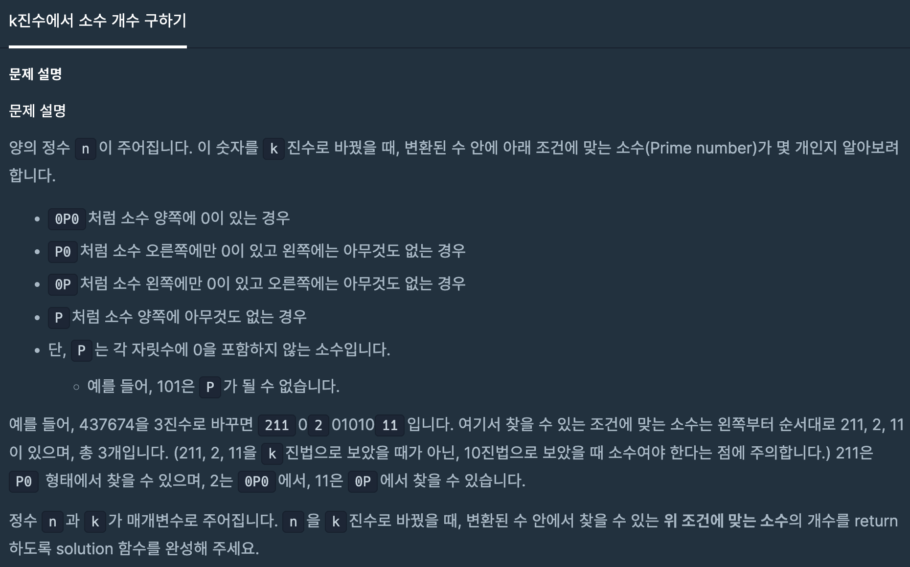

# 문제

[k진수에서 소수 개수 구하기](https://school.programmers.co.kr/learn/courses/30/lessons/92335)



# 접근방식

1. 양의 정수 n을 k진수로 변경(`change()`)

2. `0`을 기준으로 숫자 자르기(`0P0`, `P0`, `0P` 이기 때문에 그냥 잘라도 됌)
3. 얻은 수들이 소수인지 판별(`prime_number()`)
   이때 중복을 허용했으므로 중복된 원소가 있어도 삭제하지 않는다.

# 코드

```python
import math

solution(n, k):
    answer = -1
    prime_list = []

    n = change(n, k)
    p_list = n.split("0")

    while "1" in p_list:
        p_list.remove("1")

    while "" in p_list:
        p_list.remove("")

    for p in p_list:
        if prime_number(int(p)):
            prime_list.append(p)

    answer = len(prime_list)

    return answer


# 진수 변환 함수
def change(n, k):
    rev_base = ""

    while n > 0:
        n, mod = divmod(n, k)
        rev_base += str(mod)

    return rev_base[::-1]


# 소수 확인 함수:
def prime_number(n):
    for i in range(2, int(math.sqrt(n)) + 1):
        if n % i == 0:
            return False
    return True
```
